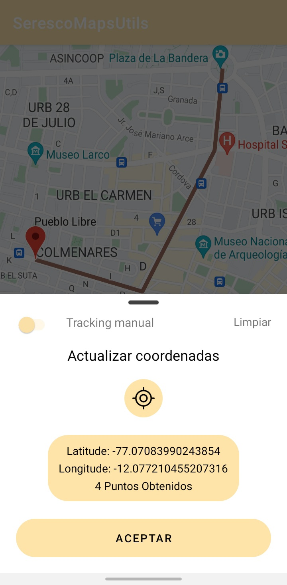
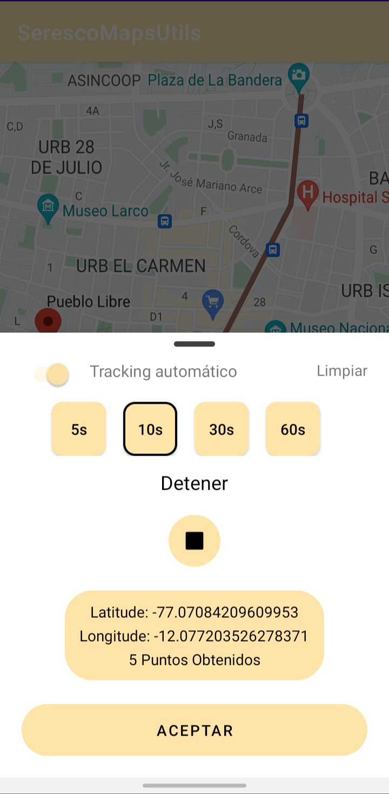
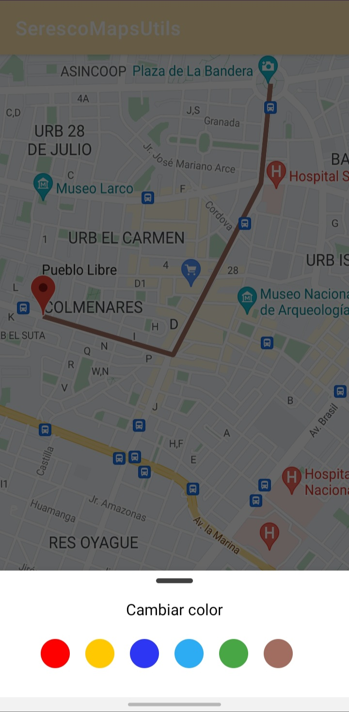

Seresco Maps Utils Android
=======

## Description

A maps utils library for Android using Google Maps Api

- **Tracking**
- **KML**
- **Cluster**
- **Markers**

<p float="left">
  
  
  
</p>

Usage
--------

e.g. Displaying Tracking Panel

```kotlin
import seresco.maps.utils.lib.utils.tracking.TrackingUtils

private val trackingUtils = TrackingUtils(this, this)

fun openTrackingPanel() {
    trackingUtils.openTrackingPanel(supportFragmentManager)
}

fun showTrackedRoute() {
    trackingUtils.showSavedCoordinates(supportFragmentManager, googleMap)
}
```

Installation
--------
Add in the settings.gradle at the end of repositories:
```groovy
repositories {
	maven { url 'https://jitpack.io' }
}
```
And add the dependencies
```groovy
dependencies {
    // Utilities for Maps SDK for Android (requires Google Play Services) 
    implementation 'com.google.maps.android:android-maps-utils:2.4.0'
    implementation 'com.github.cysseresco:seresco_maps_utils_android:0.0.1'
}
```
