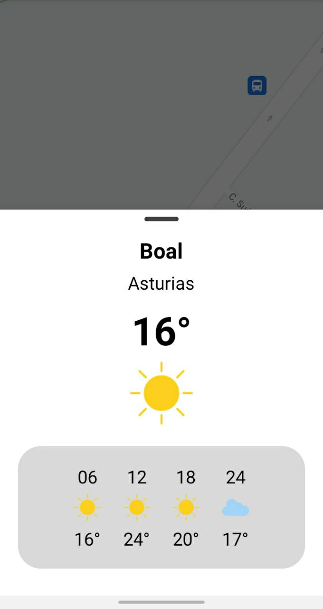

Weather Prediction
=======

Allow users to get the current weather prediction of the day.

  

How to use
--------

You have two methods to call the bottomSheet, in the first you have to pass the postal code of the municipality, in the second, you have to pass the coordinates in the parameters

1. meteorologyUtils.openWeatherPredictionSheet(33004, supportFragmentManager)
2. meteorologyUtils.openWeatherPredictionSheet(this, it.latitude, it.longitude, supportFragmentManager) 

Propuestas
--------
1. ¿Añadir una opción para ver el clima de hoy y mañana?
2. ¿Agregar información de viento, probPrecipitacion, cotaNieveProv, etc?
